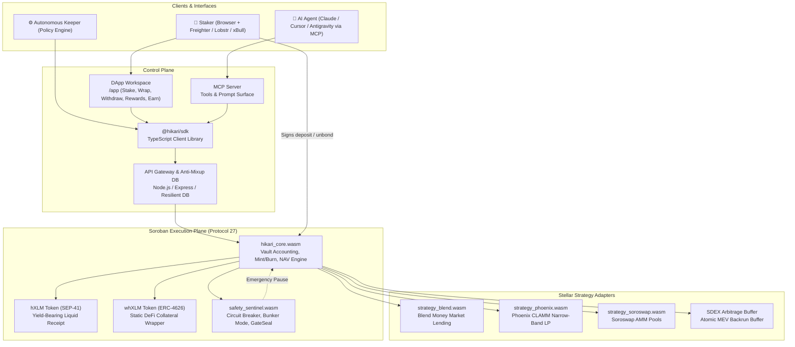
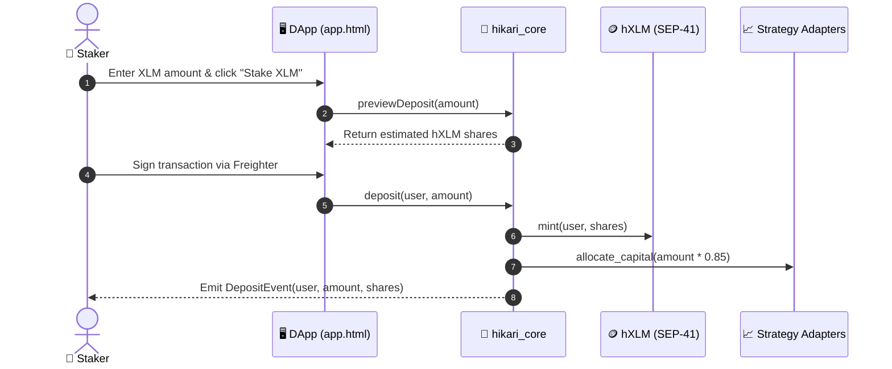

# Hikari Protocol — Architecture Specification

> **Autonomous Liquid Staking, Multi-Strategy Yield Routing & Agentic Execution on Stellar Protocol 27 (Soroban)**
> Complete system blueprint detailing the Soroban smart contract suite, autonomous keeper pipelines, mathematical solvency invariants, x402 payment channels, and MCP agent interfaces.

---

## Table of contents

1. [System overview](#1-system-overview)
2. [Component inventory & repo layout](#2-component-inventory--repo-layout)
3. [The liquid staking lifecycle](#3-the-liquid-staking-lifecycle)
4. [Soroban smart contract suite](#4-soroban-smart-contract-suite)
5. [Autonomous keeper & MEV backrun engine](#5-autonomous-keeper--mev-backrun-engine)
6. [Safety sentinel & circuit breakers](#6-safety-sentinel--circuit-breakers)
7. [x402 micropayments & MCP agent surface](#7-x402-micropayments--mcp-agent-surface)
8. [Trust boundaries & formal invariants](#8-trust-boundaries--formal-invariants)
9. [File map](#9-file-map)

---

## 1. System overview

Hikari operates across three unified planes sharing a common mathematical invariant and non-custodial execution model:

- **Control Plane**: Modern web frontend (`frontend/public/`), developer client SDK (`@hikari/sdk`), and Model Context Protocol (MCP) server for autonomous AI agents.
- **Execution Plane**: Soroban smart contracts on Stellar Protocol 27 (`contracts/hikari_core`, `strategy_blend`, `strategy_phoenix`, `strategy_soroswap`, `safety_sentinel`). All asset movements are strictly signed by users or triggered by verified on-chain invariants.
- **Optimization Plane**: Autonomous off-chain keeper robots (`engine/src/`) and an atomic MEV backrunner that monitors SDEX and Soroban orderbooks, capturing cross-venue arbitrage and compounding 100% of proceeds into staker NAV.



---

## 2. Component inventory & repo layout

| Component | Responsibility | Path | Status |
| --------- | -------------- | ---- | ------ |
| **DApp Workspace** | 5-tab user interface (Stake, Wrap, Withdrawals, Rewards, Earn) with Card on Top -> FAQ Under hierarchy | `frontend/public/app.html` | ✅ Live |
| **DApp State Engine** | Wallet connection, reactive tab switching, real-time calculations, and toast dispatcher | `frontend/public/app.js` | ✅ Live |
| **Landing & Showcase** | Architecture highlights, TVL telemetry, and interactive mobile simulation banner | `frontend/public/index.html` | ✅ Live |
| **Design System** | Tailored dark theme CSS, mobile responsive layouts, and modal components | `frontend/public/styles.css` | ✅ Live |
| **`@hikari/sdk`** | TypeScript SDK providing NAV queries, deposit builders, and unbonding status checks | `sdk/src/client.ts` | ✅ Live (5/5 tests) |
| **Policy & Risk Engine** | Invariant verification, drawdown monitoring, and circuit breaker activation | `engine/src/` | ✅ Live (8/8 tests) |
| **Security & DB Backend** | Multi-tenant address isolation, cryptographic nonces, and tamper-evident audit logs | `frontend/server.js` | ✅ Live (7/7 tests) |
| **Soroban Smart Contracts** | Rust smart contracts compiling to Soroban WASM targets | `contracts/` | ✅ Live |

---

## 3. The liquid staking lifecycle

### 3.1 Deposit and Staking
1. **Quote Request**: The user enters an XLM amount in the DApp or agent calls `previewDeposit()`.
2. **NAV Valuation**: The core contract computes current shares to mint:
   $$\text{Shares to Mint} = \frac{\text{Deposit Amount} \times \text{Total Shares}}{\text{Total Pooled XLM}}$$
3. **Transaction Submission**: The user signs a non-custodial transaction via Freighter. XLM transfers to `hikari_core`, and freshly minted `hXLM` is transferred to the user's wallet.
4. **Strategy Deployment**: Autonomous keepers batch unallocated XLM into approved adapters (Blend and Phoenix), keeping $\ge 15\%$ in liquid reserves.

### 3.2 Dual Unbonding Options
- **Queue-Based Settlement**:
  1. User calls `request_withdraw(shares)`.
  2. `hXLM` is burned, and a verifiable unbonding claim ticket is registered in the on-chain FIFO queue.
  3. After the 1–3 day epoch cooldown, user calls `claim_withdraw(ticket_id)` to receive native XLM.
- **Instant DEX Swap**:
  1. User selects "Use DEX Instant Swap" in the UI.
  2. An atomic swap route is executed on Soroswap / Phoenix CLAMM, swapping `hXLM` for `XLM` in $\approx 5$ seconds.



---

## 4. Soroban smart contract suite

### 4.1 `hikari_core`
The central accounting vault and share registry:
- Implements the SEP-41 token standard for `hXLM`.
- Tracks global reserves: $R_{\text{liquid}} + \sum A_{\text{strategy}} = R_{\text{total}}$.
- Manages the unbonding FIFO ticket queue and cooldown epochs.
- Enforces the 15% liquid reserve floor before any external strategy allocation.

### 4.2 Strategy Adapters
- **`strategy_blend`**: Supplies XLM to Blend lending pools, earns variable interest, and claims BLND governance tokens.
- **`strategy_phoenix`**: Deploys concentrated liquidity within dynamically adjusted tick ranges on the XLM-USDC and XLM-hXLM pairs.
- **`strategy_soroswap`**: Supplies constant-product liquidity and provides routing paths for instant unbonding swaps.

### 4.3 `whXLM` Static Wrapper
For external lending protocols that do not support rebasing or share-price appreciating tokens:
- Wraps `hXLM` at a 1:1 nominal exchange rate.
- Tracks underlying asset value via an ERC-4626 style `convertToAssets()` oracle method.

---

## 5. Autonomous keeper & MEV backrun engine

Hikari keepers are autonomous daemons that monitor the Stellar network every ledger close (~5 seconds):

1. **Harvest & Compound**: Accrued protocol rewards (BLND, PHX) are harvested, swapped to XLM, and added to the pool reserve, continuously driving up `hXLM` NAV.
2. **Atomic MEV Backrunning**:
   - Keepers listen to SDEX orderbook fills via Horizon streaming.
   - When a large SDEX trade dislocates the price of XLM/USDC from Phoenix or Soroswap, the keeper submits an atomic multi-operation transaction:
     $$\text{Buy on SDEX} \longrightarrow \text{Sell on Phoenix CLAMM} \longrightarrow \text{Deposit Profit into Vault}$$
   - Because all legs execute in a single atomic Stellar transaction, there is zero inventory or market risk. If the spread collapses, the transaction reverts cleanly.

---

## 6. Safety sentinel & circuit breakers

The `safety_sentinel` contract acts as an autonomous risk arbiter:

- **Drawdown Guard**: If any individual strategy experiences an NAV decline exceeding 5% in a 24-hour window, the strategy is automatically paused.
- **Bunker Mode**: If network-wide volatility or a major depeg occurs, Bunker Mode activates:
  - New deposits and rebalancing are paused.
  - All available strategy capital is unwound to liquid XLM reserves.
  - Redemptions are processed strictly pro-rata from verified cash reserves.
- **GateSeal Multisig**: An ephemeral, one-time emergency pause key held by protocol guardians to freeze vulnerable code paths without requiring contract upgrades.

---

## 7. x402 micropayments & MCP agent surface

Hikari is built from the ground up for autonomous AI agent operations:

### 7.1 x402 HTTP Payment Facilitator
APIs requiring computational resources (e.g. predictive yield analytics, automated TWAP execution) return an `HTTP 402 Payment Required` response with Stellar CAIP-2 payment headers:
- Cost: $0.001 USDC (or equivalent XLM).
- Payment verified on-chain within 5 seconds using SEP-41 token authorization.

### 7.2 Model Context Protocol (MCP) Server
Exposes 5 core tools to AI agents:
1. `hikari_get_vault_stats`: Real-time TVL, APR, NAV, and strategy allocations.
2. `hikari_quote_stake`: Expected `hXLM` shares for a given XLM deposit.
3. `hikari_build_stake_tx`: Construct unsigned XDR transaction for staking.
4. `hikari_quote_withdraw`: Estimate proceeds for queued vs instant DEX unbonding.
5. `hikari_get_risk_telemetry`: Bunker Mode status, strategy drawdowns, and solvency proofs.

---

## 8. Trust boundaries & formal invariants

### Invariant 1: Mathematical Solvency
At all times $t$, total verifiable assets under management must strictly equal or exceed outstanding share liability:
$$R_{\text{liquid}} + \sum_{i=1}^{n} \text{StrategyAssets}_i \ge \text{TotalShares} \times \text{NAV}_t$$

### Invariant 2: Reserve Liquidity Floor
Liquid native XLM held in `hikari_core` must never drop below 15% of total pool assets under normal operation:
$$\frac{R_{\text{liquid}}}{R_{\text{total}}} \ge 0.15$$

### Invariant 3: Monotonic Share Appreciation
Excluding extreme slash events, NAV per share is non-decreasing over time:
$$\text{NAV}_{t+1} \ge \text{NAV}_t$$

---

## 9. File map

```text
Hikari/
├── contracts/                     # Soroban Rust smart contracts
│   ├── hikari_core/               # Vault, share minting, unbonding queue
│   ├── strategy_blend/            # Blend money market adapter
│   ├── strategy_phoenix/          # Phoenix CLAMM concentrated LP adapter
│   └── safety_sentinel/           # Circuit breakers & Bunker Mode
├── sdk/                           # @hikari/sdk TypeScript package
│   ├── src/client.ts              # Core HikariClient methods
│   └── src/test.ts                # SDK unit verification suite
├── engine/                        # Yield policy and risk engine
│   ├── src/policyVerifier.ts      # Automated invariant validation
│   └── src/riskEngine.ts          # Bunker Mode & GateSeal triggers
├── frontend/                      # Web dashboard & DApp workspace
│   ├── server.js                  # Express backend & anti-mixup cloud DB
│   └── public/
│       ├── index.html             # Landing page & simulation banner
│       ├── app.html               # 5-Tab DApp workspace (Card on Top -> FAQ Under)
│       ├── app.js                 # Frontend state & reactive toast dispatcher
│       └── styles.css             # Design tokens & responsive mobile layouts
├── docs/                          # Comprehensive documentation suite
│   ├── PROPOSAL.md                # Stellar Community Fund grant proposal
│   ├── ARCHITECTURE.md            # System architecture specification
│   ├── ROADMAP.md                 # Multi-phase milestone roadmap
│   ├── INTENT_API.md              # Intent schema & keeper API
│   ├── ORACLE_SPEC.md             # Soroban oracle interface
│   ├── STRATEGY_RISK_REPUTATION.md# Strategy scoring & dispute resolution
│   ├── SECURITY.md                # Security model & vulnerability disclosure
│   ├── THREAT_MODEL.md            # STRIDE threat analysis & mitigations
│   ├── NON_CUSTODY.md             # Non-custodial architectural proof
│   ├── SEP_COMPLIANCE.md          # Stellar standards matrix
│   ├── CONTRIBUTOR_LADDER.md      # Contributor progression & governance
│   ├── COOKBOOK.md                # Developer recipes & SDK snippets
│   ├── FAQ.md                     # Comprehensive protocol FAQs
│   ├── BENCHMARKS.md              # Gas & CPU instruction benchmarks
│   ├── MCP.md                     # Model Context Protocol agent guide
│   └── SDK.md                     # Complete SDK API reference
└── .github/                       # GitHub Actions CI & issue templates
    ├── ISSUE_TEMPLATE/            # Good-first-issue, bug, feature, strategy
    ├── workflows/                 # CI, CodeQL, Commitlint, Vercel Deploy
    └── PULL_REQUEST_TEMPLATE.md   # Pull request guidelines
```
