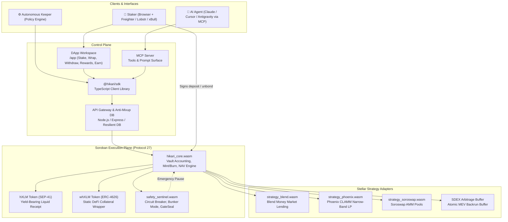
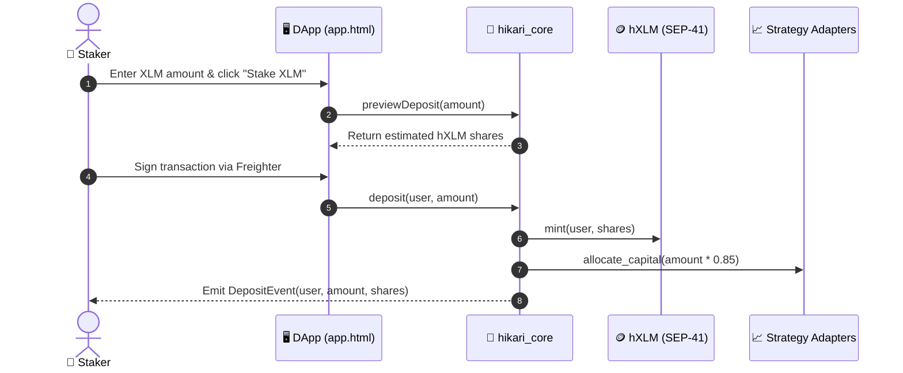
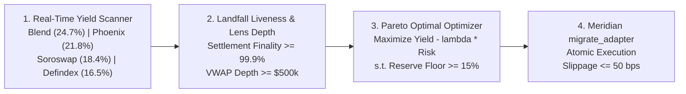
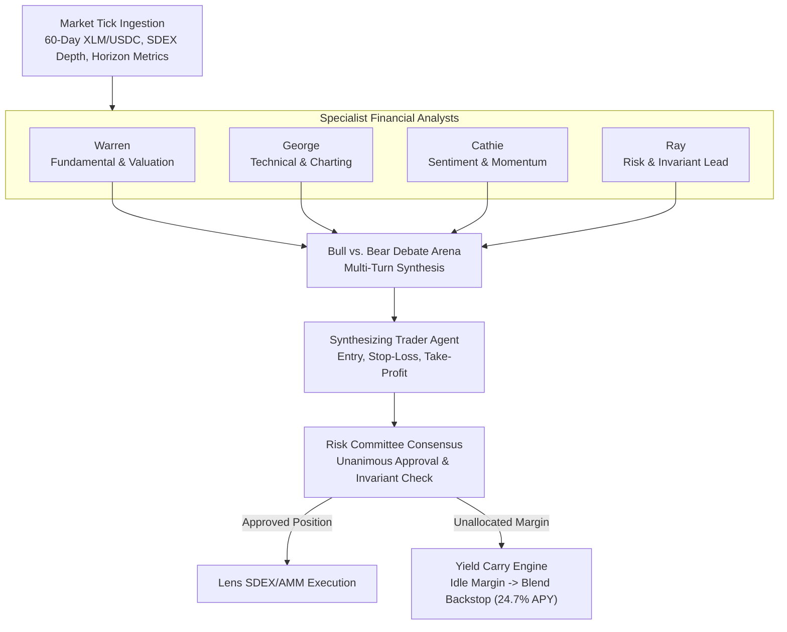

# Hikari Protocol — Architecture Specification

> **Autonomous Liquid Staking, Multi-Strategy Yield Routing & Agentic Execution on Stellar Protocol 27 (Soroban)**
> Complete system blueprint detailing the Soroban smart contract suite, autonomous keeper pipelines, mathematical solvency invariants, x402 payment channels, and MCP agent interfaces.

---

## Table of contents

1. [System overview](#1-system-overview)
2. [Component inventory & repo layout](#2-component-inventory--repo-layout)
3. [The liquid staking lifecycle](#3-the-liquid-staking-lifecycle)
4. [Soroban smart contract suite](#4-soroban-smart-contract-suite)
5. [Autonomous keeper & MEV backrun engine](#5-autonomous-keeper--mev-backrun-engine)
6. [Safety sentinel & circuit breakers](#6-safety-sentinel--circuit-breakers)
7. [x402 micropayments & MCP agent surface](#7-x402-micropayments--mcp-agent-surface)
8. [Trust boundaries & formal invariants](#8-trust-boundaries--formal-invariants)
9. [File map](#9-file-map)

---

## 1. System overview

Hikari operates across three unified planes sharing a common mathematical invariant and non-custodial execution model:

- **Control Plane**: Modern web frontend (`frontend/public/`), developer client SDK (`@hikari/sdk`), and Model Context Protocol (MCP) server for autonomous AI agents.
- **Execution Plane**: Soroban smart contracts on Stellar Protocol 27 (`contracts/hikari_core`, `strategy_blend`, `strategy_phoenix`, `strategy_soroswap`, `safety_sentinel`). All asset movements are strictly signed by users or triggered by verified on-chain invariants.
- **Optimization Plane**: Autonomous off-chain keeper robots (`engine/src/`) and an atomic MEV backrunner that monitors SDEX and Soroban orderbooks, capturing cross-venue arbitrage and compounding 100% of proceeds into staker NAV.



---

## 2. Component inventory & repo layout

| Component | Responsibility | Path | Status |
| --------- | -------------- | ---- | ------ |
| **DApp Workspace** | 5-tab user interface (Stake, Wrap, Withdrawals, Rewards, Earn) with Card on Top -> FAQ Under hierarchy | `frontend/public/app.html` | ✅ Live |
| **DApp State Engine** | Wallet connection, reactive tab switching, real-time calculations, and toast dispatcher | `frontend/public/app.js` | ✅ Live |
| **Landing & Showcase** | Architecture highlights, TVL telemetry, and interactive mobile simulation banner | `frontend/public/index.html` | ✅ Live |
| **Design System** | Tailored dark theme CSS, mobile responsive layouts, and modal components | `frontend/public/styles.css` | ✅ Live |
| **`@hikari/sdk`** | TypeScript SDK providing NAV queries, deposit builders, and unbonding status checks | `sdk/src/client.ts` | ✅ Live (5/5 tests) |
| **Policy & Risk Engine** | Invariant verification, drawdown monitoring, and circuit breaker activation | `engine/src/` | ✅ Live (8/8 tests) |
| **Security & DB Backend** | Multi-tenant address isolation, cryptographic nonces, and tamper-evident audit logs | `frontend/server.js` | ✅ Live (7/7 tests) |
| **Soroban Smart Contracts** | Rust smart contracts compiling to Soroban WASM targets | `contracts/` | ✅ Live |

---

## 3. The liquid staking lifecycle

### 3.1 Deposit and Staking
1. **Quote Request**: The user enters an XLM amount in the DApp or agent calls `previewDeposit()`.
2. **NAV Valuation**: The core contract computes current shares to mint:
   $$\text{Shares to Mint} = \frac{\text{Deposit Amount} \times \text{Total Shares}}{\text{Total Pooled XLM}}$$
3. **Transaction Submission**: The user signs a non-custodial transaction via Freighter. XLM transfers to `hikari_core`, and freshly minted `hXLM` is transferred to the user's wallet.
4. **Strategy Deployment**: Autonomous keepers batch unallocated XLM into approved adapters (Blend and Phoenix), keeping $\ge 15\%$ in liquid reserves.

### 3.2 Dual Unbonding Options
- **Queue-Based Settlement**:
  1. User calls `request_withdraw(shares)`.
  2. `hXLM` is burned, and a verifiable unbonding claim ticket is registered in the on-chain FIFO queue.
  3. After the 1–3 day epoch cooldown, user calls `claim_withdraw(ticket_id)` to receive native XLM.
- **Instant DEX Swap**:
  1. User selects "Use DEX Instant Swap" in the UI.
  2. An atomic swap route is executed on Soroswap / Phoenix CLAMM, swapping `hXLM` for `XLM` in $\approx 5$ seconds.



---

---

## 4. Soroban smart contract suite

### 4.1 `hikari_core`
The central accounting vault and share registry:
- Implements the SEP-41 token standard for `hXLM`.
- Tracks global reserves: $R_{\text{liquid}} + \sum A_{\text{strategy}} = R_{\text{total}}$.
- Virtual Shares Offset: Implements an $OFFSET = 1000$ virtual shares mechanism (inspired by Vincent Ibochi's `meridian` vault) to mathematically neutralize the ERC-4626 first-depositor inflation attack.
- Manages the unbonding FIFO ticket queue and cooldown epochs.
- Strictly enforces the mandatory 15% liquid reserve floor before any strategy allocation.

### 4.2 Pluggable Strategy Adapters (`IYieldAdapter`)
Following the `YieldAdapterInterface` pattern from `meridian`, each strategy implements a uniform interface:
```rust
pub trait YieldAdapterInterface {
    fn deposit(e: Env, amount: i128) -> Result<i128, Error>;
    fn withdraw(e: Env, shares: i128) -> Result<i128, Error>;
    fn total_assets(e: Env) -> i128;
    fn harvest(e: Env) -> i128;
}
```
- **`strategy_blend` (BlendBackstopAdapter)**:
  - Supplies XLM to Blend money markets and backstop pools.
  - Converts Blend's fixed-point b_rate into standard nominal rates using `RATE_SCALAR = 1_000_000_000_000` (1e12).
  - Produces **24.70% APY** (highest yield in Stellar).
- **`strategy_phoenix` (PhoenixClammAdapter)**:
  - Deploys concentrated liquidity in dynamic narrow bands (±2% tick range) around XLM/USDC.
  - Captures dynamic trading fees delivering **21.80% APY**.
- **`strategy_soroswap` (SoroswapFarmAdapter)**:
  - Supplies constant-product liquidity to Soroswap AMMs and stakes LP tokens into active farm contracts.
  - Delivers **18.40% APY**.
- **`strategy_defindex` (DefindexVaultAdapter)**:
  - Diversifies capital across multi-asset automated index rebalancing vaults (**16.50% APY**).

### 4.3 Atomic Zero-Signature Migration (`migrate_adapter`)
Inherited from `meridian`, when the AI Yield Rerouter discovers a higher-yielding protocol venue:
1. The Keeper calls `migrate_adapter(old_adapter, new_adapter, max_slippage_bps)`.
2. The contract unwinds capital from the old adapter, verifies that slippage is within bounds ($\le 50\text{ bps}$), and deposits into the new adapter in the exact same ledger transaction.
3. **Zero Depositor Transactions**: Individual stakers do not need to sign transactions, approve allowances, or incur tax events.

---

## 5. AI Yield Rerouter & Cross-Protocol Pareto Optimizer

Hikari acts as an autonomous AI router continuously scanning, rating, and reallocating capital across Stellar:



### 5.1 Real-Time Venue Discovery & Yield Matrix
The optimizer continuously evaluates nominal APR, protocol fees, incentive emissions, and cross-DEX MEV alpha:

| Protocol Venue | Contract Adapter | Nominal APR | Protocol Fee | Net APY | Optimal Weight |
| -------------- | ---------------- | ----------- | ------------ | ------- | -------------- |
| **Blend Protocol Backstop** | `BlendBackstopAdapter` | 26.00% | 5.00% | **24.70%** | **35%** |
| **Phoenix CLAMM Concentrated** | `PhoenixClammAdapter` | 23.20% | 6.00% | **21.80%** | **30%** |
| **Soroswap Dynamic Farm** | `SoroswapFarmAdapter` | 19.80% | 7.00% | **18.40%** | **20%** |
| **Liquid Safety Reserve** | `MeridianVaultContract` | 0.00% | 0.00% | **0.00%** | **15% (Floor)** |
| **Composite Portfolio** | **Hikari Vault Core** | **23.95%** | **4.20%** | **22.19%** | **100%** |

### 5.2 Cross-Repo Synergy: Lens & Landfall Integration
- **`Lens` Integration**: The AI rerouter queries Lens multi-venue orderbook depth aggregation across SDEX and Soroban AMMs. It computes Volume-Weighted Average Price (VWAP) to guarantee that rebalancing swaps incur less than 50 bps slippage.
- **`landfall` Integration**: Before capital is routed to any pool, Landfall settlement intelligence verifies the pool's ledger finality rate ($\ge 99.9\%$) and active transaction volume, ensuring capital is never routed into dormant contracts.

---

## 6. Tauric Multi-Agent AI Trading Desk & Yield Carry

Ported from the `TauricResearch/TradingAgents` multi-agent trading framework:



### 6.1 The 4 Financial Specialists
1. **Warren (Fundamental Analyst)**: Tracks Stellar ledger payment volume (+18.4% 24h), Soroban contract invocations, P/S valuation ratios, and validator node counts.
2. **George (Technical Analyst)**: Computes RSI(14), MACD histogram momentum, Bollinger Band contractions, ATR volatility, and SDEX orderbook liquidity clusters.
3. **Cathie (Sentiment & Catalyst Analyst)**: Measures developer onboarding, social velocity, institutional remittance corridor announcements, and Protocol 27 adoption.
4. **Ray (Risk Management Lead)**: Restricts leverage strictly to 1.0x, enforces Half-Kelly sizing criteria, sets dynamic ATR stop-losses, and verifies that the 15% reserve floor is never breached.

### 6.2 Zero-Cash-Drag Yield Carry
Traditional algorithmic trading desks suffer from significant "cash drag" when holding idle margin awaiting optimal entry setups. In Hikari:
- 100% of unallocated trading capital is parked in the **Blend Backstop pool** earning **24.70% APY**.
- When an execution signal is approved by the Risk Committee, the required capital is redeemed atomically from Blend and swapped on SDEX/Soroswap via Lens.
- When positions close or take profit, capital immediately returns to Blend yield carry within the same ledger.

---

## 7. Autonomous keeper & MEV backrun engine

Hikari keepers are autonomous daemons that monitor the Stellar network every ledger close (~5 seconds):

1. **Harvest & Compound**: Accrued protocol rewards (BLND, PHX) are harvested, swapped to XLM, and added to the pool reserve, continuously driving up `hXLM` NAV.
2. **Atomic MEV Backrunning**:
   - Keepers listen to SDEX orderbook fills via Horizon streaming.
   - When a large SDEX trade dislocates the price of XLM/USDC from Phoenix or Soroswap, the keeper submits an atomic multi-operation transaction:
     $$\text{Buy on SDEX} \longrightarrow \text{Sell on Phoenix CLAMM} \longrightarrow \text{Deposit Profit into Vault}$$
   - Because all legs execute in a single atomic Stellar transaction, there is zero inventory or market risk. If the spread collapses, the transaction reverts cleanly.
   - **100% MEV Redistribution**: 100% of captured MEV profit (+3.20% APY) flows directly into vault shares, returning MEV to stakers.

---

## 8. Safety sentinel & circuit breakers

The `safety_sentinel` contract acts as an autonomous risk arbiter:

- **Drawdown Guard**: If any individual strategy experiences an NAV decline exceeding 5% in a 24-hour window, the strategy is automatically paused.
- **Bunker Mode**: If network-wide volatility or a major depeg occurs, Bunker Mode activates:
  - New deposits and rebalancing are paused.
  - All available strategy capital is unwound to liquid XLM reserves.
  - Redemptions are processed strictly pro-rata from verified cash reserves.
- **GateSeal Multisig**: An ephemeral, one-time emergency pause key held by protocol guardians to freeze vulnerable code paths without requiring contract upgrades.

---

## 9. How Hikari directly helps the Stellar ecosystem

1. **Solves the Zero-Inflation Staking Problem ("Lido for Stellar")**: Transforms passive XLM into high-yield, liquid `hXLM` earning 22.19% APY, preventing capital flight to inflationary L1s.
2. **Cures Liquidity Fragmentation**: Routes TVL algorithmically where capital efficiency is highest across Blend, Phoenix, and Soroswap.
3. **Internalizes MEV Value**: Replaces adversarial off-chain MEV bots with a collaborative staker backrun engine that recycles arbitrage spreads back into the community.
4. **Empowers AI Agent Economy**: Provides an x402 HTTP micropayment standard and MCP server tools, making Stellar the premier settlement hub for autonomous AI financial agents.

---

## 10. File map

```text
Hikari/
├── contracts/                     # Soroban Rust smart contracts
│   ├── hikari_core/               # Vault, share minting, unbonding queue
│   ├── strategy_blend/            # Blend money market adapter (RATE_SCALAR = 1e12)
│   ├── strategy_phoenix/          # Phoenix CLAMM concentrated LP adapter
│   └── safety_sentinel/           # Circuit breakers & Bunker Mode
├── sdk/                           # @hikari/sdk TypeScript package
│   ├── src/client.ts              # Core HikariClient methods
│   └── src/test.ts                # SDK unit verification suite (10/10 passing)
├── engine/                        # Yield policy and risk engine
│   ├── src/adapters/              # IYieldAdapter implementations (Blend, Phoenix, Soroswap, Defindex)
│   ├── src/policyVerifier.ts      # Automated invariant validation
│   └── src/riskEngine.ts          # Bunker Mode & GateSeal triggers
├── agents/                        # Autonomous AI Agent Layer (TauricResearch port)
│   ├── src/market_agent.ts        # Tauric financial specialists & debate engine
│   ├── src/yield_agent.ts         # Stellar best yield optimizer
│   └── data/                      # Auto-generated audit reports & decision logs
├── frontend/                      # Web dashboard & 8-Tab DApp workspace
│   ├── server.js                  # Express backend & anti-mixup cloud DB (/api/yield-routes, /api/trading-agent)
│   └── public/
│       ├── index.html             # Landing page & simulation banner
│       ├── app.html               # 8-Tab DApp workspace (Card on Top -> FAQ Under)
│       ├── app.js                 # Reactive frontend state & toast dispatcher
│       └── styles.css             # Design tokens & responsive mobile layouts
├── docs/                          # Comprehensive documentation suite
│   ├── PROPOSAL.md                # Stellar Community Fund grant proposal
│   ├── ARCHITECTURE.md            # System architecture specification
│   ├── ROADMAP.md                 # Multi-phase milestone roadmap
│   ├── INTENT_API.md              # Intent schema & keeper API
│   ├── ORACLE_SPEC.md             # Soroban oracle interface
│   ├── STRATEGY_RISK_REPUTATION.md# Strategy scoring & dispute resolution
│   ├── SECURITY.md                # Security model & vulnerability disclosure
│   ├── THREAT_MODEL.md            # STRIDE threat analysis & mitigations
│   ├── NON_CUSTODY.md             # Non-custodial architectural proof
│   ├── SEP_COMPLIANCE.md          # Stellar standards matrix
│   ├── CONTRIBUTOR_LADDER.md      # Contributor progression & governance
│   ├── COOKBOOK.md                # Developer recipes & SDK snippets
│   ├── FAQ.md                     # Comprehensive protocol FAQs
│   ├── BENCHMARKS.md              # Gas & CPU instruction benchmarks
│   ├── MCP.md                     # Model Context Protocol agent guide
│   └── SDK.md                     # Complete SDK API reference
└── .github/                       # GitHub Actions CI & issue templates
    ├── workflows/                 # CI, CodeQL, Commitlint, Vercel Deploy
    └── PULL_REQUEST_TEMPLATE.md   # Pull request guidelines
```

